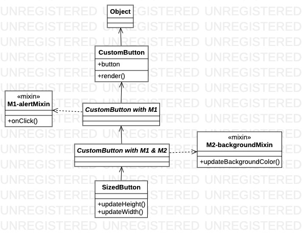

# JavaScript Mixins

This project showcases the mixin design pattern using JavaScript. [@naveenk2k](https://github.com/naveenk2k) and I made this for [PESU](http://pes.edu/)'s UE18CS341 (Design Patterns) course.

## Installation

Clone the repo using one of the following methods:
- SSH: `git clone git@github.com:neelkamath/js-mixins.git`
- HTTPS: `git clone https://github.com/neelkamath/js-mixins.git`

## Usage

- Open `object-assign.html` in a browser to see the UI demo which uses the `Object.assign()` technique to implement mixins.
- Open `multiple-inheritance.html` in a browser to see the printers demo which uses multiple inheritance to implement mixins.
